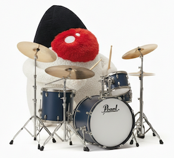

[](https://jitpack.io/#umjammer/vavi-sound-d77)
[](https://github.com/umjammer/vavi-sound-d77/actions/workflows/maven.yml)
[](https://github.com/umjammer/vavi-sound-d77/actions/workflows/codeql.yml)


# vavi-sound-d77



🎹 this is the javax.sound.midi spi synthesizer for the [WebSynth D-77](https://github.com/M-HT/websynth_d-77) wrapped by jna. 

## Install

### maven

 * https://jitpack.io/#umjammer/vavi-sound-d77

### WebSynth D-77

```shell
$ git clone https://github.com/M-HT/websynth_d-77
$ cd websynth_d-77/d77_coredrv
$ vi Makefile.aarch64-llasm-ptrofs.Darwin
```

```diff
diff --git a/d77_coredrv/Makefile.aarch64-llasm-ptrofs.Darwin b/d77_coredrv/Makefile.aarch64-llasm-ptrofs.Darwin
index 3f10a6f..a23ed4e 100644
--- a/d77_coredrv/Makefile.aarch64-llasm-ptrofs.Darwin
+++ b/d77_coredrv/Makefile.aarch64-llasm-ptrofs.Darwin
@@ -1,5 +1,7 @@
-all: d77_coredrv
+all: d77_coredrv libd77_coredrv.dylib
 
+llasm_dir=../../SR/llasm
+llvm_bin=/opt/homebrew/Cellar/llvm/21.1.8/bin
 llasm_c_files := ../websynth/llasm/asm-cpu.c ../websynth/llasm/asm-cpu-var.c ../websynth/llasm/functions-llasm.c ../websynth/llasm/llasm_float.c ../websynth/llasm/llasm_movs.c ../websynth/llasm/llasm_pushx.c ../websynth/llasm/llasm_stos.c
 llasm_h_files := ../websynth/llasm/llasm_cpu.h
 llasm_ptrofs_c_file := ../websynth/ptrofs/functions-32bit.c
@@ -9,11 +11,14 @@ llasm_source_file := ../websynth/llasm/dswbsWDM.llasm
 llasm_include_files := ../websynth/llasm/extern.llinc ../websynth/llasm/llasm.llinc ../websynth/llasm/llasm_float.llinc ../websynth/llasm/llasm_movs.llinc ../websynth/llasm/llasm_pushx.llinc ../websynth/llasm/llasm_stos.llinc ../websynth/llasm/macros.llinc ../websynth/llasm/seg01_code.llinc ../websynth/llasm/seg01_data.llinc ../websynth/llasm/seg02_data.llinc ../websynth/llasm/seg03_data.llinc ../websynth/llasm/seg05_data.llinc
 
 $(llasm_object_file): $(llasm_source_file) $(llasm_include_files)
-       llasm $(llasm_source_file) -O -m64 -pic -ptrofs -inline-float | opt -O3 | llc -O=3 -filetype=obj -mtriple=arm64-apple-darwin --relocation-model=pic > $(llasm_object_file)
+       ${llasm_dir}/llasm $(llasm_source_file) -O -m64 -pic -ptrofs -inline-float | ${llvm_bin}/opt -O3 | ${llvm_bin}/llc -O=3 -filetype=obj -mtriple=arm64-apple-darwin --relocation-model=pic > $(llasm_object_file)
 
 d77_coredrv: d77_coredrv.c ../websynth/websynth.h $(llasm_c_files) $(llasm_h_files) $(llasm_ptrofs_c_file) $(llasm_ptrofs_h_file) $(llasm_object_file)
        $(CC) -O2 -Wall -DPTROFS_64BIT -o d77_coredrv d77_coredrv.c $(llasm_c_files) $(llasm_ptrofs_c_file) $(llasm_object_file) -I../websynth -I../websynth/llasm -I../websynth/ptrofs -lm -framework CoreMIDI -framework CoreFoundation -framework AudioToolbox
 
+libd77_coredrv.dylib: d77_coredrv.c ../websynth/websynth.h $(llasm_c_files) $(llasm_h_files) $(llasm_ptrofs_c_file) $(llasm_ptrofs_h_file) $(llasm_object_file)
+       $(CC) -dynamiclib -O2 -Wall -DPTROFS_64BIT -o libd77_coredrv.dylib d77_coredrv.c $(llasm_c_files) $(llasm_ptrofs_c_file) $(llasm_object_file) -I../websynth -I../websynth/llasm -I../websynth/ptrofs -lm -framework CoreMIDI -framework CoreFoundation -framework AudioToolbox
+
 .PHONY: clean
 clean:
-       rm -f d77_coredrv $(llasm_object_file)
+       rm -f d77_coredrv libd77_coredrv.dylib $(llasm_object_file)
```

```shell
$ make -f Makefile.aarch64-llasm-ptrofs.Darwin
```

## Usage

### system property

`vavi.sound.midi.d77.datafile` ... specify data file path.

e.g.

`System.setProperty("vavi.sound.midi.d77.datafile", "/usr/local/src/websynth_d-77/datafile/dswebWDM.dat")`

### jvm arg

`jna.library.path` ... specify shared library location.

e.g.

`-Djna.library.path=/usr/local/src/websynth_d-77/d77_coredrv`

### sample

 * [sample](src/test/java/vavi/sound/midi/d77/TestCase.java)

## References

 * [original](https://github.com/M-HT/websynth_d-77)

## TODO

 * native builder

---

<sub>image designed by @umjammer, drawn by nano banana</sub>
